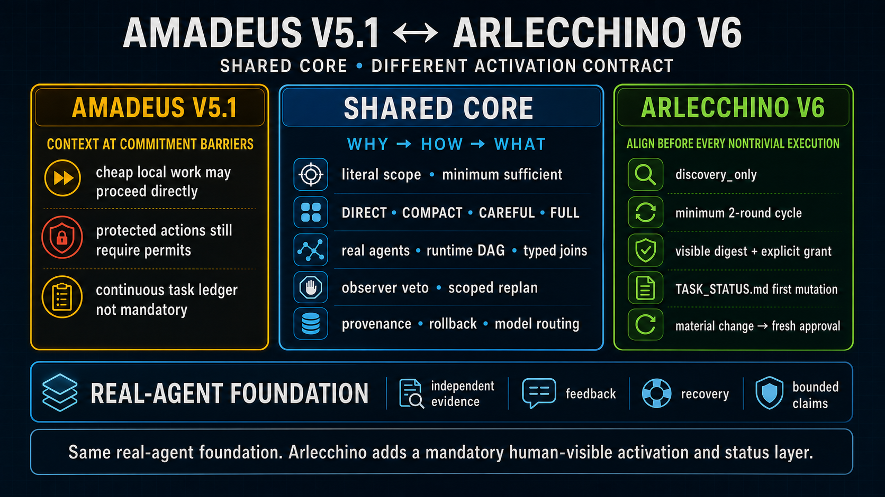
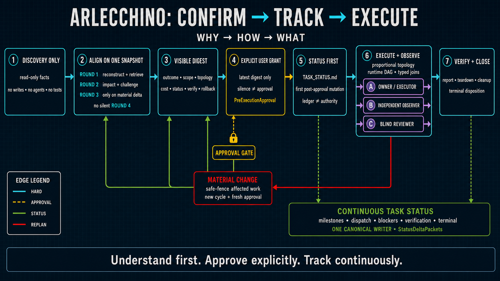

# Amadeus Workflow: Generations 1 and 2

[Project repository](https://github.com/kurisujhin/Amadeus_Multi_Agent)

> **Naming contract.** **Amadeus** is the overall workflow and the name of **Generation 1**. **Arlecchino** is **Generation 2 of the Amadeus workflow**, not a separate workflow.

Amadeus turns consequential work from a single-context performance of “thinking carefully” into an inspectable real-agent system: explicit scope, separate runtimes, independently grounded evidence, observable dispatch, binding control, scoped recovery, and claims limited by verification.

Generation 2 keeps that foundation and adds mandatory human-visible activation and continuous status. The difference between the generations is primarily their activation contract.

## Generation map

| Level | Name | Reference release | Role |
|---|---|---|---|
| Workflow family | **Amadeus** | — | The overall real-agent workflow |
| Generation 1 | **Amadeus** | V5.1 | Establishes the real-agent foundation and barrier-based controls |
| Generation 2 | **Arlecchino** | V6 | Adds mandatory pre-execution alignment, explicit task-level approval, and continuous status |



The shared foundation is intentionally larger than the generational difference:

- Golden Circle reasoning: **Why → How → What**;
- literal scope and minimum-sufficient work;
- proportional topology: **direct, compact, careful, full**;
- real context-separated agents, a runtime DAG, typed edges, and typed joins;
- independent evidence, blind review, observer veto, and scoped replanning; and
- provenance, rollback, recovery, workload awareness, and bounded claims.

## Shared foundation: why real agents matter

A single model can simulate planner, critic, engineer, reviewer, and approver personas. Those labels may improve organization, but they still share framing, memory, evidence exposure, and incentives. Amadeus uses real boundaries only when they can change the result.

| Property | Same-context virtual roles | Amadeus real-agent foundation |
|---|---|---|
| Framing | Several labels around one framing | Framings can be frozen separately before conclusions leak |
| Evidence | Shared memory and evidence path | Independent samples, holdouts, and direct evidence access |
| Concurrency | Usually serial role simulation | Ready nodes are dispatched with observable queue, start, and overlap state |
| Review | Structured self-critique | Context-separated adjudication against a precommitted rubric |
| Authority | One persona appears to approve another | Approval, permits, veto, and resume authority remain distinct |
| Live control | The executor judges its own drift | An observer can issue a binding pause, stop, or replan verdict |
| Recovery | Retry from shared state | Safe-fencing, partial invalidation, epoch fencing, rollback, and quarantine |
| Provenance | Conversation- or answer-level | Claim-scoped evidence, freshness, and exact artifact parity |

If a virtual-role system actually provides separate contexts, independently chosen evidence, explicit dispatch records, distinct authority, contamination controls, and typed joins, it has moved beyond roleplay and toward the Amadeus real-agent model.

## Generation 1 — Amadeus V5.1

Generation 1 establishes the core reliability model. It replaces an undifferentiated agent loop with a scope-faithful execution graph whose topology is earned by distinct uncertainty, capability, veto, effect, or independence boundaries.


1. **Freeze the contract.** Capture the requested outcome, allowed scope, invariants, metrics, authority, outputs, budget, and terminal cleanup in a `UserExecutionContract`.
2. **Close context and route.** Retrieve discoverable facts, expose direction-changing gaps, classify protected actions, and route domain, model, and capability requirements before commitment.
3. **Choose the minimum-sufficient topology.** Use `direct`, `compact`, `careful`, or `full`; never add a role merely to fill a cast list.
4. **Build the executable DAG.** Give nodes evidence targets and authority, type their edges and joins, reserve reviewer or observer capacity, and dispatch eligible independent nodes.
5. **Execute, observe, and review.** The owner senses local state; the independent observer judges goal, safety, authority, and drift; the blind reviewer separately adjudicates meaning and claims.
6. **Replan only what changed.** A correction or anomaly safe-fences affected work and invalidates only intersecting descendants and permits.
7. **Verify and finish.** Keep structural, semantic, measurement, and decision validity distinct; close provenance, rollback, cleanup, and final-artifact parity before reporting.

Generation 1 performs context closure at consequential commitment barriers: costly, protected, long-running, high-fanout, hard-to-reverse, or design-locking work. Cheap, local, reversible, objectively checked work may proceed directly after classification. Protected actions still require explicit authority and permits.

## Generation 2 — Arlecchino V6

Arlecchino is **Generation 2 of Amadeus**. It retains the real-agent foundation while making task activation and execution status visible for every nontrivial task.



### Five mandatory controls

- **Read-only discovery first.** Resolve the smallest set of facts needed for scope, clause attachment, canonical roots, collisions, authority, and the future status path. Before approval there are no task writes, agents, tests, or external effects.
- **Bounded alignment on one snapshot.** Round 1 reconstructs and retrieves. Round 2 assesses every input’s impact and challenges the design. Round 3 exists only for a material delta or contradiction; unresolved movement trips a circuit breaker rather than creating a silent Round 4.
- **A visible current digest.** The user sees the outcome, exact scope and exclusions, topology, outputs, workload, status ownership, monitoring, verification, rollback, report, teardown, cleanup, and unavailable user-owned choices.
- **A separate approval receipt.** Nontrivial execution depends on a parent-owned `PreExecutionApproval` bound to the current task, epoch, latest digest, plan, scope, snapshot, action classes, authority, cost limits, expiry, and invalidation triggers.
- **Continuous task status.** Exactly one collision-checked `TASK_STATUS.md` is created as the first post-approval mutation and maintained through milestones, dispatch, blockers, replanning, verification, cleanup, and terminal disposition.

Pure read-only answers and status responses that need only bounded inspection remain direct and create no empty ledger.

### The seven-stage activation and execution flow

1. **Discovery only:** gather read-only facts and identify the exact future effect.
2. **Align on one immutable snapshot:** complete the two-round minimum and one conditional third round.
3. **Show the visible digest:** make the plan and boundaries easy for the user to audit.
4. **Obtain an explicit user grant:** approval must refer to the latest digest; silence, a plan announcement, an older approval, or a successful result is not permission.
5. **Write status first:** create or refresh the canonical `TASK_STATUS.md`; ledger text reports authority but never creates it.
6. **Execute and observe:** dispatch the proportional runtime DAG with separated owner, observer, and reviewer functions where the task requires them.
7. **Verify and close:** finish the report, teardown, cleanup, reviewer and observer joins, and terminal disposition.

### Bounded alignment

| Round | Required? | Purpose |
|---|---|---|
| Round 1 | Yes | Reconstruct every explicit clause, resolve prior referents, and retrieve the minimum discoverable facts |
| Round 2 | Yes | Check the impact of every input and retrieval, then challenge omissions, contradictions, unnecessary work, and missing joins |
| Round 3 | Conditional | Rebuild once after a material Round-2 delta or contradiction and test convergence |
| Round 4 | Never | Continued movement becomes an explicit circuit breaker and user-visible blocker |

## Choosing the topology

Every node must earn its coordination cost.

| Mode | Topology | Appropriate use |
|---|---|---|
| `direct` | Coordinator executes; an explicit workflow invocation adds one bounded independent premise, risk, or result check | Cheap, local, reversible work with an objective oracle |
| `compact` | One owner and one context-separated reviewer | Bounded interpretation, synthesis, or experimentation where correlated framing could change the result |
| `careful` | Specialists tied to real uncertainty, plus an independent observer for effectful or mistake-prone work | External, sensitive, long-running, difficult-to-rollback, or consequential execution |
| `full` | Action-scoped approval, rollback, monitoring, recovery, restart fencing, and post-action validation | High-impact production or protected effects |

## Install Arlecchino V6

Download [`arlecchino-install-ready.tar.gz`](./arlecchino-install-ready.tar.gz) and its [SHA-256 checksum](./arlecchino-install-ready.tar.gz.sha256). Verify the download, extract it, then run the bundled installer:

```bash
shasum -a 256 -c arlecchino-install-ready.tar.gz.sha256
tar -xzf arlecchino-install-ready.tar.gz
cd arlecchino-bundle
./install.sh
```

The default destination is `${CODEX_HOME:-$HOME/.codex}`. To select another Codex root, set `CODEX_HOME` before running the installer. The installer preserves the packaged dependency closure, creates the required active skill links, and moves same-named existing entries to a timestamped directory under `$CODEX_HOME/skill-backups`.

## System requirements and limits

- **Real context separation.** Independent review, blind evidence, observable concurrency, and binding observer claims require genuine separate agent contexts and lifecycle controls.
- **Persistent writable workspace.** Generation 2 needs one unique, collision-checked location for `TASK_STATUS.md` under an approved root.
- **Verification tooling.** Python 3 is sufficient for the packaged validators; the workflow text remains readable without them, but an unvalidated domain handoff cannot be represented as validator-backed.
- **Capability-aware routing.** Mechanical, bounded implementation, consequential design, and experiment work require progressively stronger and attested model routes; critical duties do not silently downgrade.

Amadeus is a workflow-engineering design, not proof of an optimal agent count, universal cadence, or automatic quality advantage. Coordination has latency and integration cost. More agents help only when independent evidence, capability, control, or recovery can change the supported action.

The workflow cannot infer private intent, grant its own authority, choose a user-owned value tradeoff, or turn confidence into evidence. It reduces unnecessary questions by retrieving discoverable facts and pauses only where unavailable direction-changing input or authority is genuinely required.

## Sources and artifact provenance

- [Amadeus project repository](https://github.com/kurisujhin/Amadeus_Multi_Agent)
- Generation 1 chart: [`amadeus-workflow-chart-v6.png`](./amadeus-workflow-chart-v6.png), 1672 × 941 RGB, SHA-256 `8244f6b5af9157f74c26002b6a4e2ca2f90b64372f95585305c818421810036c`
- Generation 2 chart: [`arlecchino-workflow-chart.png`](./arlecchino-workflow-chart.png), 1672 × 941 RGB, SHA-256 `21d5534f2c6bfc33ed4bbd91167be30450b87ee7dbf0b58c23f0ab94ef7c4973`
- Generation comparison: [`amadeus-vs-arlecchino.png`](./amadeus-vs-arlecchino.png), 1672 × 941 RGB, SHA-256 `abd3e902641491b82bceeacbdf655a0732e965af2568941725d5f32146cc7250`
- Research background: [task partitioning and integration](https://doi.org/10.1016/j.im.2006.12.001), [coordination costs in distributed collaboration](https://doi.org/10.1016/j.respol.2007.09.001), [structured debriefs](https://pubmed.ncbi.nlm.nih.gov/23516804/), and [mixed checklist effects](https://doi.org/10.1136/bmjopen-2021-058219)

> **Bottom line.** Amadeus is one evolving workflow. Generation 1 establishes the real-agent foundation; Generation 2, Arlecchino, adds a mandatory human-visible activation and continuous-status contract.
