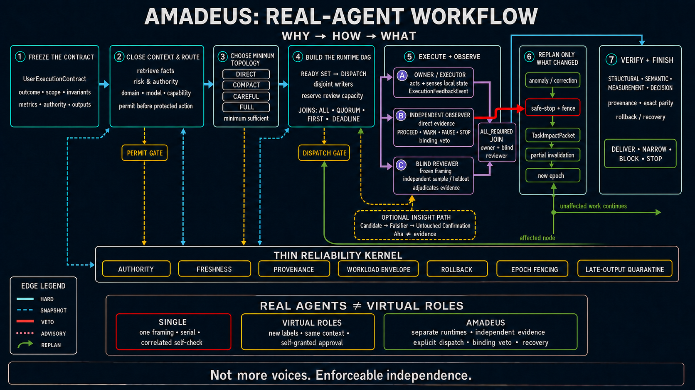

# Amadeus: real agents, enforceable independence



Amadeus is much better than a monolithic agent on consequential work for a concrete reason: it replaces “please think carefully” with mechanisms that can be inspected and enforced—separate runtimes, independently frozen framings, explicit dispatch, direct evidence, binding vetoes, scoped recovery, and provenance-backed claims.

It is not better because it creates more voices. It is better when it creates independence and control that one context cannot honestly simulate.

## What “better” means

For uncertain, long-running, expensive, sensitive, or effectful work, “better” means:

- separate framing and evidence are designed to expose and reduce shared error correlation;
- protected actions cannot proceed on confidence alone because authority, permits, and vetoes are explicit;
- work can be genuinely concurrent because ready nodes are dispatched, rather than merely narrated as parallel;
- drift is caught while execution is happening through direct evidence and binding observer decisions;
- a correction or anomaly invalidates only affected descendants, while sound independent work continues;
- rollback, restart fencing, late-output quarantine, and exact artifact parity make recovery auditable;
- the final claim is limited to what structural, semantic, measurement, and decision evidence actually supports.

That is a much stronger reliability model than one agent generating an answer and then grading its own answer.

## A simple prompt can still lead to serious work

Amadeus lets a user start with a concise, outcome-oriented prompt instead of encoding the full workflow. It turns that starting point into a `UserExecutionContract`, retrieves discoverable context, routes task-relevant domain expertise and capabilities, asks only for unavailable choices that could change the result, and builds task-specific execution and verification. That design can support high-quality outcomes across varied tasks while keeping the user’s prompt simple—provided the required evidence, authority, and success criteria can be obtained.

This is a practical kind of leverage: the user describes the outcome and important constraints; Amadeus carries the orchestration complexity. It can change the topology, evidence plan, specialists, observer controls, and verification ladder to fit the task rather than forcing the user to know and prompt every implementation step up front.

A hard-coded single-agent style skill can be excellent for a narrow, stable pattern. A fixed persona, checklist, or writing style does not by itself supply adaptive routing, independent evidence, binding vetoes, live observation, or scoped recovery when the task changes. Amadeus moves that complexity out of the initial prompt and into an inspectable workflow.

This is not prompt magic. Amadeus cannot infer missing private intent, grant authority, or choose a user-owned tradeoff. It minimizes questions by retrieving what is discoverable, then asks for the unavailable decisions that actually change the result.

## Why virtual roles are still one agent

Asking one model to “act as a planner, critic, engineer, and reviewer” can improve organization and self-critique. It does **not** by itself create independence.

| Property | Plain single agent | Single agent with virtual roles | Amadeus |
|---|---|---|---|
| Initial framing | One framing | Several labels around the same framing | Framings can be frozen separately before conclusions leak |
| Evidence | One evidence path | Usually shared memory and shared evidence | Independent samples, holdouts, and direct evidence access |
| Concurrency | Serial | Usually a serial role simulation | Ready-set dispatch with observable queue/start/overlap state |
| Review | Self-check | Structured self-critique | Context-separated adjudication against a precommitted rubric |
| Authority | The runtime approves itself | A persona grants another persona approval | Typed permits, distinct veto authority, and explicit resume authority |
| Live control | Ad hoc monitoring | The same context decides whether its own work drifted | An observer can issue a binding pause, stop, or replan verdict |
| Failure recovery | Retry from the same state | Persona-guided retry | Safe-stop, impact closure, partial invalidation, epoch fencing, quarantine |
| Provenance | Often answer-level | Usually conversation-level | Claim-scoped evidence, snapshot freshness, and exact artifact parity |
| Prompt-to-workflow adaptation | Depends on one runtime’s interpretation | Preset role/style behavior fits known patterns | A concise goal expands through context closure, routing, a task-specific DAG, and verification |
| Cost | Lowest | Low to moderate | Higher, so topology is selected proportionally |

A single context shares anchors, assumptions, memory, evidence exposure, and incentives across all its virtual roles. The “critic” already knows what the “author” hoped to prove. The “approver” is enforced by the same runtime it is meant to constrain. A role label cannot create a blind sample, a separate failure surface, real concurrent execution, or a binding veto.

If a virtual-role system really uses separate contexts, independent evidence, explicit dispatch records, distinct authority, contamination controls, and typed joins, it is no longer merely roleplay—it is converging on a real multi-agent workflow like Amadeus.

## How the workflow works

Amadeus begins with the Golden Circle, not with a cast list:

1. **Freeze the contract.** Capture the requested outcome, allowed scope, invariants, metrics, authority, outputs, budget, and terminal cleanup in a `UserExecutionContract`.
2. **Close context and route.** Retrieve discoverable facts, expose only direction-changing gaps, classify protected actions, and route domain/model/capability requirements before commitment.
3. **Choose the minimum sufficient topology.** Use `direct`, `compact`, `careful`, or `full`. A role exists only for a distinct uncertainty, capability, veto, effect, or independence boundary.
4. **Build the executable DAG.** Give nodes evidence targets and authority; type edges as hard, snapshot, veto, or advisory; type joins; reserve reviewer/observer capacity; dispatch every eligible independent node up to the real cap.
5. **Execute and observe.** The owner/executor senses local state. The independent observer judges goal, safety, authority, and drift from direct evidence. The blind reviewer separately adjudicates meaning and claims. Observer and reviewer are distinct functions, not sequential personas.
6. **Replan only what changed.** An anomaly or correction triggers safe-stop/fencing, an accepted impact decision, claim-scoped invalidation, and an epoch change when needed. Unaffected branches remain usable and ready.
7. **Verify and finish.** Separate structural, semantic, measurement, and decision validity; preserve disagreement; verify provenance, rollback/recovery, cleanup, and final artifact parity; then deliver, narrow, block, or stop.

The thin reliability kernel runs across the workflow: authority, freshness, provenance, workload modeling, rollback, epoch fencing, and quarantine of late or stale output.

The optional insight path is equally disciplined. A surprising idea becomes an `InsightCandidate`, not evidence. It must survive an authority/safety screen, the cheapest useful falsifier, untouched confirmation when warranted, and context-separated review. An “Aha” never bypasses a veto.

## Four traces through the chart

These traces are a quick way to tell whether an implementation is genuinely Amadeus-shaped.

### 1. Cheap local task

The contract is bounded, reversible, and objectively checkable. The topology selector chooses `direct`; the coordinator performs the edit and one focused check. Amadeus avoids inventing agents whose coordination cost cannot change the result.

### 2. Bounded interpretation

The selector chooses `compact`. The owner and blind reviewer receive the raw task independently. Before seeing the owner’s conclusion, the reviewer freezes scope, rival interpretations, an independent sample, and an expectation-independent control. Their results meet at an `all_required` join; disagreement is preserved until evidence resolves it or the claim is narrowed.

### 3. Long or effectful action

Suppose a production migration must preserve availability and rollback. The workflow closes authority and compatibility facts, freezes a workload envelope, reserves an observer, and issues a permit only for the authorized snapshot and stage. The executor runs the bounded action while the observer watches direct progress and integrity signals. Drift causes a binding pause; recovery follows the declared rollback boundary; post-action validation is a separate gate.

### 4. Mid-task correction

A user correction is typed as a semantic event. Affected work is fenced first. The designated designer evaluates the correction against the whole original task, the coordinator accepts the resulting `TaskImpactPacket`, and only intersecting nodes, evidence, and permits are invalidated. A new epoch fences stale output while unaffected branches continue.

## Why this advantage compounds

Independent review catches different mistakes only when its framing and evidence have not already been contaminated. Binding controls matter only when the executor cannot silently waive them. Observation matters only when it can change continuation. Provenance matters only when a changed artifact reopens the claims it actually affects. Amadeus connects all four conditions in one runtime graph.

A single agent—even a very capable one—can imitate the language of these controls. It cannot, within one shared context, supply the same evidence that those boundaries were real.

## When a single agent is the right answer

Amadeus is not a claim that more agents always produce better answers. Coordination has real latency, cost, and integration risk. For a cheap, local, reversible task with an objective oracle, a single agent is usually the best topology—and Amadeus explicitly chooses `direct`.

Use the heavier modes when the cost of correlated error, hidden drift, unauthorized action, or bad recovery is larger than the coordination cost. The workflow should earn every node.

## Domain maturity note

The author is currently focused on recommender systems, so the search, ranking, and recommendation domain has the strongest direct author attention. The other domain skills provide useful workflow gates and starting points, but applying Amadeus there may require additional effort from the user to supply qualified domain experts, authoritative sources, domain-specific acceptance criteria, and independent validation. Treat the packaged domain guidance as orchestration support—not a substitute for subject-matter expertise—especially for consequential decisions outside recommender systems.

## System requirements

- **Platform and runtime:** Amadeus targets an OpenAI Codex environment that can load Codex Skills and run genuine, context-separated agents. The `compact`, `careful`, and `full` workflows require lifecycle controls to create, dispatch concurrently, message, observe, wait for, and stop independent agents, plus a way to enforce binding pause, veto, and resume decisions. A single conversational context—even when prompted to simulate multiple personas—does not satisfy Amadeus's real-agent independence contract. In a single-context environment, Amadeus's guidance may still inform bounded direct work, but the run is non-independent and must not be presented as a fully compliant Amadeus real-agent execution.
- **Installation and filesystem:** Extract the [complete archive](../amadeus-v5.1-complete-install.tar.gz) into the Codex home directory, not directly into its `skills` subdirectory:

  ```bash
  tar -xzf amadeus-v5.1-complete-install.tar.gz \
    -C "${CODEX_HOME:-$HOME/.codex}"
  ```

  Preserve the packaged `skills/` and `subskills/` directory structure. The installing user needs write access to the target directory and `tar` or an equivalent archive tool. The companion [SHA-256 file](../amadeus-v5.1-complete-install.tar.gz.sha256) can be used to verify the downloaded archive.
- **Python:** The native domain-handoff validator requires Python 3 and uses only the standard library; no `pip` dependencies are needed. Use Python 3.10 or newer as a conservative supported baseline. This package was verified with Python 3.11.2. Without Python, the skill text remains readable, but a native domain handoff is incomplete because its rendered JSON cannot pass the packaged validator.
- **Model routing:** Mechanical R0 work defaults to `gpt-5.6-luna` at `low`, with `gpt-5.6-terra` at `medium` as an upward-capability fallback. Bounded, known-design R1 implementation defaults to `gpt-5.6-terra` at `medium`, with Sol-high as an upward fallback. Consequential R2 architecture, topology, risk, safety, skill review, and `careful`/`full` observation require exact `gpt-5.6-sol` at `high` or stronger Sol reasoning. R3 experiment design, analysis, and independent experiment review require exact `gpt-5.6-sol` at `ultra`.
- **Degradation boundary:** R2 and R3 have no downward model fallback. Their model identity and reasoning level must be selectable, accepted, enforceable, and attested; otherwise Amadeus must wait, narrow the task, or keep critical output advisory. Without a genuine multi-agent runtime, the workflow guidance may still be consulted, but real-agent independence, blind review, observable concurrency, and binding-observer claims do not apply.

## Research limits

Amadeus is a workflow-engineering design, not proof of a universal law about LLM teams. Human research on task partitioning, coordination, structured debriefs, and insight motivates testable hypotheses; it does not prove an optimal agent count or topology for language models. Evaluate the workflow on the target task with fixed rubrics, untouched confirmation where the claim warrants it, and latency/cost counter-metrics.

Useful background includes work on [task partitioning and integration](https://doi.org/10.1016/j.im.2006.12.001), [coordination costs in distributed collaboration](https://doi.org/10.1016/j.respol.2007.09.001), and [structured debriefs](https://pubmed.ncbi.nlm.nih.gov/23516804/).

## Artifact provenance

- Chart: [`amadeus-workflow-chart-v6.png`](./amadeus-workflow-chart-v6.png)
- Canvas: 1672 × 941 RGB PNG
- SHA-256: `8244f6b5af9157f74c26002b6a4e2ca2f90b64372f95585305c818421810036c`

### Text alternative

The chart is a left-to-right seven-stage workflow: contract → context/routing → proportional topology → runtime DAG → separated execution/observation/review → scoped replan → verification/finish. A red veto connects the independent observer to safe-stop and fencing. A green loop returns only changed work through impact review, partial invalidation, and a new epoch, while unaffected work continues. Below it, the thin reliability kernel spans the execution stages, and a comparison inset contrasts one agent, same-context virtual roles, and Amadeus real-agent controls.
